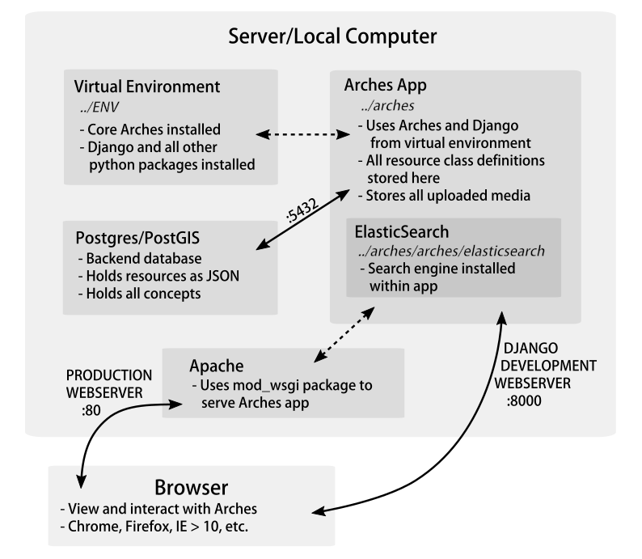
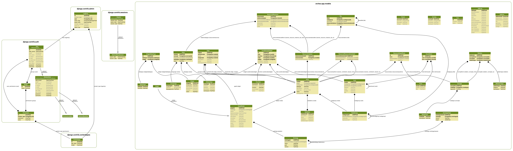
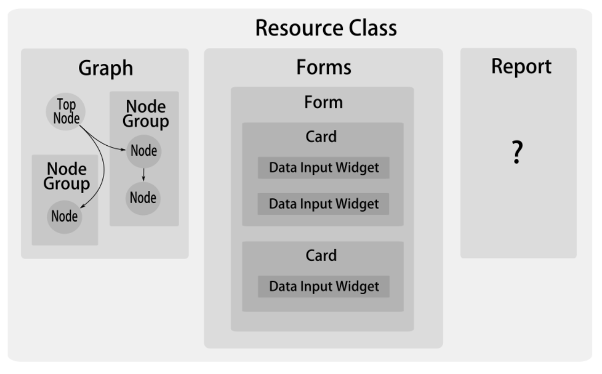
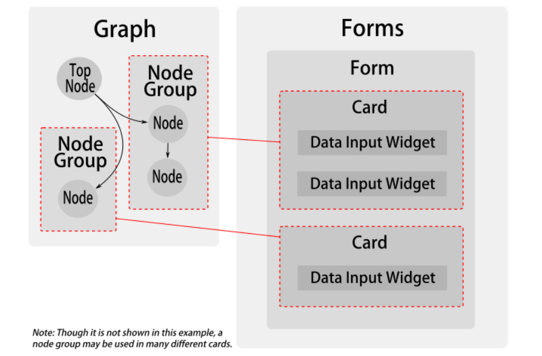

# System Design

## System Architecture
Arches is based on Django and uses Postgres/PostGIS for its database backend. Unlike v3, v4 now stores all resource business data as "tiles" (see below), which are JSON objects in the Postgres database; PostGIS is now only used for auxiliary overlay tables.



Each Arches installation includes its own instance of ElasticSearch that resides within the app itself. ElasticSearch is extremely fast and very flexible, allowing adjacent Arches apps to either share clusters or operate completely independent of each other.

In development, the Django webserver can be used to view Arches through a browser. In production, a real webserver (like Apache or nginx) must be used.

[I know all of the distribution architecture hasn't been fully decided, so this can be filled out more and modified at a later date -AC 7/15]

## Data Model Overview

In many ways, the Arches Data Model has been completely re-imagined in v4. This was necessary to support the new [Resource Manager](#resource-manager) user interface, which allows you to create and configure resource classes within the app itself. Arches' models can now be split into four general categories:

1. [Resource Class-Related Models](#resource-class-overview)
    + [Graph Definition](#graph-definition)
    + [UI Component Models](#resource-class-ui-components)
    + [Resource Instance Data](#resource-class-data)
2. [Overlays](#overlay-models)
3. [RDM (Reference Data Manager)](#rdm-models)
4. [Edit Log](#edit-log)

[I'm thinking it may make sense to break ontologies out into a separately numbered category. Right now they are described in the graph definition section. -AC]

These categories are described in the following sections, as well as the most important logical models in each one. For a complete picture, here is the full visual data model.

[](http://archesproject.github.io/docs/img/data-model.png)

## Resource Class Overview

Resources in an Arches database are separated into distinct resource "classes" (not to be confused with Python classes!), and in v4 the way a user creates and manages these classes has been completely redesigned. Arches now handles all of these operations within the app interface in the Resource Manager, and resource classes are defined with modular components that can be re-used throughout the system. The three basic components of a resource class are a graph, a set of data entry forms, and a report. In the Arches interface, each of these components comprise various sub-components, as illustrated below.



The Arches logical model has been developed to support this modular construction, and the relevant models are described below as they pertain to the graph, forms (UI components), and the resource data itself (not illustrated above) [though perhaps it should be... -AC].

### Graph Definition

Graphs are collections of NodeGroups, which are themselves collections of Nodes. All Nodes and NodeGroups are connected to each other by Edges. NodeGroups allow for a modular approach to creating resource graphs, as a NodeGroup can easily be copied from one graph to another.

NodeGroups can be a single Node or many Nodes. A basic example of a NodeGroup would be a E1_NAME Node and E55_NAME_TYPE Node. If each name is paired with a name_type, then you must group together these two nodes in order to support multiple name/name_type combos associated with a given resource. NodeGroup represents the logical model-level requirement that certain sets of nodes must be grouped together to retain meaning.

Nodegroups are used to create Cards (see [below](#resource-class-ui-components), and this is done based on the cardinality property. Therefore, not every nodegroup will be used to create a card, which allows nodegroups to exist within other nodegroups. The `parentnodegroup` property is used to create this nesting.

Ontologies are enforced on GraphModel instances. An ontology is a schema that standardizes a set of node classes and edge classes, with restrictions on which nodes can be connected to each other, and which edges can connect them. Therefore, nodes not only define the fields of data (attributes) for resource classes, but also the semantic "glue nodes" that do not store business data but are required to meet ontology rules.

By default, Aches uses the [CIDOC CRM](http://www.cidoc-crm.org/), an ontology created by ICOM (International Council of Museums) to model cultural heritage documentation. However, a user may decide to create a graph that has no ontology constraints, or may create and load an entirely new ontology. Once an ontology is chosen for a graph instance, all nodegroups within that graph must conform to it. The `Ontology` and `OntologyClass` models are not shown here, but you can find them in the full data model above.

Validation instances handle base-level data validations that will be applied at the graph level.  For example, `isrequired` will be an example of a validation, which would return false if a given node is left empty. This is distinct from the concept of Functions which are applied at the UI level for more superficial validation.

[In the current visual data model, I don't actually see where validations are connected to nodes.  -AC]

Not shown here is the definition of the GraphModel class, one of which would be associated with each resource class, and to which all descendant NodeGroups are attached.

```python
class NodeGroup(models.Model):
    nodegroupid = models.UUIDField(primary_key=True, default=uuid.uuid1)  # This field type is a guess.
    cardinality = models.TextField(blank=True, default='n')
    legacygroupid = models.TextField(blank=True, null=True)
    parentnodegroup = models.ForeignKey('self', db_column='parentnodegroupid', blank=True, null=True)
    class Meta:
        managed = True
        db_table = 'node_groups'
```

```python
class Node(models.Model):
    nodeid = models.UUIDField(primary_key=True, default=uuid.uuid1)
    name = models.TextField()
    description = models.TextField(blank=True, null=True)
    istopnode = models.BooleanField()
    ontologyclass = models.TextField(blank=True, null=True)
    datatype = models.TextField()
    nodegroup = models.ForeignKey(NodeGroup, db_column='nodegroupid', blank=True, null=True)
    graph = models.ForeignKey(Graph, db_column='graphid', blank=True, null=True)
```
    
```python
class Edge(models.Model):
    edgeid = models.UUIDField(primary_key=True, default=uuid.uuid1)
    name = models.TextField(blank=True, null=True)
    description = models.TextField(blank=True, null=True)
    ontologyproperty = models.TextField(blank=True, null=True)
    domainnode = models.ForeignKey('Node', db_column='domainnodeid', related_name='edge_domains')
    rangenode = models.ForeignKey('Node', db_column='rangenodeid', related_name='edge_ranges')
    graph = models.ForeignKey(Graph, db_column='graphid', blank=True, null=True)
    class Meta:
        managed = True
        db_table = 'edges'
        unique_together = (('rangenode', 'domainnode'),)
```

```python
class Validation(models.Model):
    validationid = models.UUIDField(primary_key=True, default=uuid.uuid1)  # This field type is a guess.
    validation = models.TextField(blank=True, null=True)
    validationtype = models.TextField(blank=True, null=True)
    name = models.TextField(blank=True, null=True)
    description = models.TextField(blank=True, null=True)
    class Meta:
        managed = True
        db_table = 'validations'
```

### UI Component Models

A number of models exist specifically to support the resource class UI. The purpose of this is to create direct relationships between the graph and the data entry forms that are used to create resource instances. Generally, the process works like this:

1. The graph is made of NodeGroups instances that define what information will be gathered for a given resource class.
2. The forms are made of Cards that are tied to specific NodeGroups and define which input Widgets will be used to gather values for each Node.

[ 3. describing how tiles are created per node group may have a place in this list... -AC]



Each resource class has any number of Forms attached to it, which are meant to thematically categorize sets of data entry UI. Forms are made up of one or more Cards. Cards are UI representations of a NodeGroup, and they encapsulate the Widgets that facilitate data entry for each Node in a given NodeGroup instance.

While a Card will only handle data entry for a single NodeGroup (which may have many Nodes or children NodeGroups), a single NodeGroup can be handled by more than one Card. This allows a NodeGroup to be represented on one Card in the web app, and in a different Card in the mobile app. Like a NodeGroup, a Card may be nested within a parent Card, which is necesary in the case of wizards/card groups. [does it look too insane to capitalize any occurance of a model in the text? feels very german. -AC]

Functions serve to apply logic dictating data validation or UI behavior based on some data entry event. Functions will, for example, call validations asynchronously to alert users of invalid data that has been entered to a form.  They may also serve to hide or expose certain cards or forms based on data that has been populated into a widget. A Function instance can be used on any combination of Card, Node, and Widget instances.

```python
class Form(models.Model): 
    formid = models.UUIDField(primary_key=True, default=uuid.uuid1)
    title = models.TextField(blank=True, null=True)
    subtitle = models.TextField(blank=True, null=True)
    class Meta:
        managed = True
        db_table = 'forms'
```

```python
class Card(models.Model):
    cardid = models.UUIDField(primary_key=True, default=uuid.uuid1)
    name = models.TextField(blank=True, null=True)
    title = models.TextField(blank=True, null=True)
    subtitle = models.TextField(blank=True, null=True)
    helptext = models.TextField(blank=True, null=True)
    nodegroup = models.ForeignKey('NodeGroup', db_column='nodegroupid', blank=True, null=True)
    parentcard = models.ForeignKey('self', db_column='parentcardid', blank=True, null=True)
    class Meta:
        managed = True
        db_table = 'cards'
```

```python
class Widget(models.Model):
"Widgets are the individual UI components in which data are entered."
    widgetid = models.UUIDField(primary_key=True, default=uuid.uuid1)
    name = models.TextField()
    template = models.FileField(storage=widget_storage_location)
    defaultlabel = models.TextField(blank=True, null=True)
    defaultmask = models.TextField(blank=True, null=True)
    helptext = models.TextField(blank=True, null=True)
    class Meta:
        managed = True
        db_table = 'widgets'
```

```python
class Function(models.Model):
    functionid = models.UUIDField(primary_key=True, default=uuid.uuid1)
    functiontype = models.TextField()
    function = models.TextField(blank=True, null=True)
    name = models.TextField(blank=True, null=True)
    description = models.TextField(blank=True, null=True)
    class Meta:
        managed = True
        db_table = 'functions'
```

### Resource Data

Three models are used to store the actual resource data:

+ ResourceInstance - one per resource in the database
+ Tile - tile instances store all business data
+ ResourceXResource - record relationships between resource instances

Creating a new resource in the database instantiates a new ResourceInstance, which belongs to one resource class and has a unique `resourceinstanceid`. A resource instance may also have its own security/permissions properties in order to allow a fine-grained level of user-based permissions. [This is preliminary, as I don't thinkthe permissions systems have been fully implemented yet. -AC]

Once data have been captured, they are stored as "tiles" in the database. Each tile stores **one instance of all of the attributes of a given nodegroup for a resource instance**, as referenced by the `resourceinstanceid`. This business data is stored as a JSON object, with key/value pairs defining node.name (from the nodes table) and the value associated with the node. Note that all business data are stored within this JSON object; there are no separate database columns for dates, text, or geometry business data.

Arches allows for the creation of relationships between resources, and these are stored as instances of the ResourceXResource model. The `relationshiptype` must correspond to the appropriate top node in the RDM. This constrains the list of available types of relationships available between resource instances.

```python
class ResourceInstance(models.Model):
    resourceinstanceid = models.UUIDField(primary_key=True, default=uuid.uuid1)
    resourceclass = models.ForeignKey(Node, db_column='resourceclassid')
    resourceinstancesecurity = models.TextField(blank=True, null=True) #Intended to support flagging individual resources as unavailable to given user roles.
    "At present, this field is not fully baked.  Idea here is to acknowldge that we need to be able to apply role-based security at a resourceinstance by resourceinstance level."
    class Meta:
        managed = True
        db_table = 'resource_instances'
```

```python
class Tile(models.Model):
    tileid = models.UUIDField(primary_key=True, default=uuid.uuid1)
    data = JSONField(blank=True, null=True, db_column='tiledata')
    resourceinstance = models.ForeignKey(ResourceInstance, db_column='resourceinstanceid')
    parenttile = models.ForeignKey('self', db_column='parenttileid', blank=True, null=True)
    nodegroup = models.ForeignKey(NodeGroup, db_column='nodegroupid')
    class Meta:
        managed = True
        db_table = 'tiles'
```

```python
class ResourceXResource(models.Model):
    resourcexid = models.AutoField(primary_key=True)
    relationshiptype = models.ForeignKey('Value', db_column='relationshiptype')
    resourceinstanceidfrom = models.ForeignKey('ResourceInstance', db_column='resourceinstanceidfrom', blank=True, null=True, related_name='resxres_resource_instance_ids_from')
    resourceinstanceidto = models.ForeignKey('ResourceInstance', db_column='resourceinstanceidto', blank=True, null=True, related_name='resxres_resource_instance_ids_to')
    notes = models.TextField(blank=True, null=True)
    datestarted = models.DateField(blank=True, null=True)
    dateended = models.DateField(blank=True, null=True)
    class Meta:
        managed = True
        db_table = 'resource_x_resource'		
```
        
## RDM Models

The RDM (Reference Data Manager) stores vocabulary for your entire Arches database--e.g. any value that would appear in a dropdown in the data entry forms. This reference data is stored as a web of hierarchically-related Concepts (connected by Relation instances), each of which is defined by a Value instance.

```python
class Concept(models.Model):
    conceptid = models.UUIDField(primary_key=True, default=uuid.uuid1)  # This field type is a guess.
    nodetype = models.ForeignKey('DNodeType', db_column='nodetype')
    legacyoid = models.TextField(unique=True)
    class Meta:
        managed = True
        db_table = 'concepts'
```

```python
class Relation(models.Model):
    relationid = models.UUIDField(primary_key=True, default=uuid.uuid1)
    conceptfrom = models.ForeignKey(Concept, db_column='conceptidfrom', related_name='relation_concepts_from')
    conceptto = models.ForeignKey(Concept, db_column='conceptidto', related_name='relation_concepts_to')
    relationtype = models.ForeignKey(DRelationType, db_column='relationtype')
    class Meta:
        managed = True
        db_table = 'relations'
```
        
```python
class Value(models.Model):
    valueid = models.UUIDField(primary_key=True, default=uuid.uuid1)  # This field type is a guess.
    concept = models.ForeignKey('Concept', db_column='conceptid')
    valuetype = models.ForeignKey(DValueType, db_column='valuetype')
    value = models.TextField()
    language = models.ForeignKey(DLanguage, db_column='languageid', blank=True, null=True)
    class Meta:
        managed = True
        db_table = 'values'		
```

## Overlay Models

The three tables in this category are a place to store data that may be served to Arches as an overlay. There is no direct interaction (or requirement by) the Arches application for these tables to be populated. They exist in case a user wants to have readily available information such as parcels, address, or administrative boundaries to visualize and/or search by. The overlays table stores GIS data that supports the capability described [here](https://arches-hip.readthedocs.org/en/latest/loading-data/#optional-gis-layers-for-administrative-areas).

<!--
| Address                 |
| ------ | ----------- |
| addressid | Auto |
| addressnum | text |
| edittype | text |
| newvalue | text |
| note | text 
| oldvalue | text |
| resourceclassid | text |
| resourceinstanceid | text |
| tileinstanceid | text |
| timestamp | date |
| userid | text |
| user_firstname | text |
| user_lastname | text |
| user_email | text |
-->

```python
class Address(models.Model):
    addressesid = models.AutoField(primary_key=True)
    addressnum = models.TextField(blank=True, null=True)
    addressstreet = models.TextField(blank=True, null=True)
    city = models.TextField(blank=True, null=True)
    geometry = models.PointField(blank=True, null=True)
    postalcode = models.TextField(blank=True, null=True)
    vintage = models.TextField(blank=True, null=True)
    class Meta:
        managed = True
        db_table = 'addresses'
```

```python
class Parcel(models.Model):
    parcelapn = models.TextField(blank=True, null=True)
    vintage = models.TextField(blank=True, null=True)
    parcelsid = models.AutoField(primary_key=True)
    geometry = models.PolygonField(blank=True, null=True)
    class Meta:
        managed = True
        db_table = 'parcels'
```

```python
class Overlay(models.Model):
    overlaytyp = models.TextField(blank=True, null=True)
    overlayval = models.TextField(blank=True, null=True)
    overlayid = models.AutoField(primary_key=True)
    geometry = models.PolygonField(blank=True, null=True)
    class Meta:
        managed = True
        db_table = 'overlays'
```

## Edit Log

A change in a tile (i.e. any change to a resource instance) is recorded as an instance of the EditLog model.

<!--
| editlogid | UUID |
| ------ | ----------- |
| attributenodeid | text |
| edittype | text |
| newvalue | text |
| note | text 
| oldvalue | text |
| resourceclassid | text |
| resourceinstanceid | text |
| tileinstanceid | text |
| timestamp | date |
| userid | text |
| user_firstname | text |
| user_lastname | text |
| user_email | text |
-->

```python
class EditLog(models.Model):
    editlogid = models.UUIDField(primary_key=True, default=uuid.uuid1)
    resourceclassid = models.TextField(blank=True, null=True)
    resourceinstanceid = models.TextField(blank=True, null=True)
    attributenodeid = models.TextField(blank=True, null=True)
    tileinstanceid = models.TextField(blank=True, null=True)
    edittype = models.TextField(blank=True, null=True)
    newvalue = models.TextField(blank=True, null=True)
    oldvalue = models.TextField(blank=True, null=True)
    timestamp = models.DateTimeField(blank=True, null=True)
    userid = models.TextField(blank=True, null=True)
    user_firstname = models.TextField(blank=True, null=True)
    user_lastname = models.TextField(blank=True, null=True)
    user_email = models.TextField(blank=True, null=True)
    note = models.TextField(blank=True, null=True)

    class Meta:
        managed = True
        db_table = 'edit_log'
```


---

## ORIGINAL CONTENT

nodegroups - defines the sets of nodes that should be saved in a single tile record.  For example, NAME and NAME_TYPE.  Recursive relationship supports the ability to create nodegroups within nodegroups i.e. sub-branches of condition assessment.

cards - frames widgets necessary for capturing and editing tile data.  Expecting that each nodegroup will be associated to one card.  Cards have a recursive relationship to manage wizards… cards within cards.

Keeping the tables separate because cards represent UI elements and nodegroups represent grouped data.

old header: Visual Data Model


old header: Data Model Decisions

Within the physical data model, we will keep nodegroups and cardgroups as separate tables because it is possible that a single nodegroup can be visualized on two separate cards within two separate manifestations of the UI.  The envisioned use case is where one nodegroup is represented on one card in the web app, and in a different card in the mobile app.   Therefore, nodegroups have a one-to-many relationship with cards and require separate tables.

old header: Graphs/Cards/Widgets/Reports

The graph manager will only allow you to create graphs that are internally consistent with the ontology(ies) (i.e. all classes and properties used in your graph will need to be in your ontology). 

Graph import will follow the same convention as the graph manager, that is an imported graph must be internally consistent with the ontology(ies). In the event a user tries to load a graph that is not consistent with the ontology(ies), import will fail and an error log will be printed detailing the errors.

old header: Validation/Functions

old header: Search
