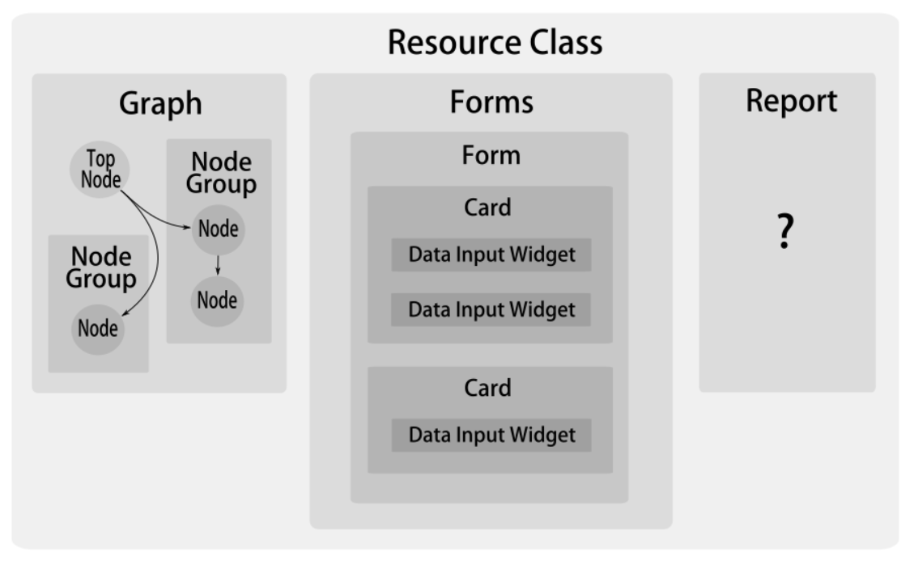
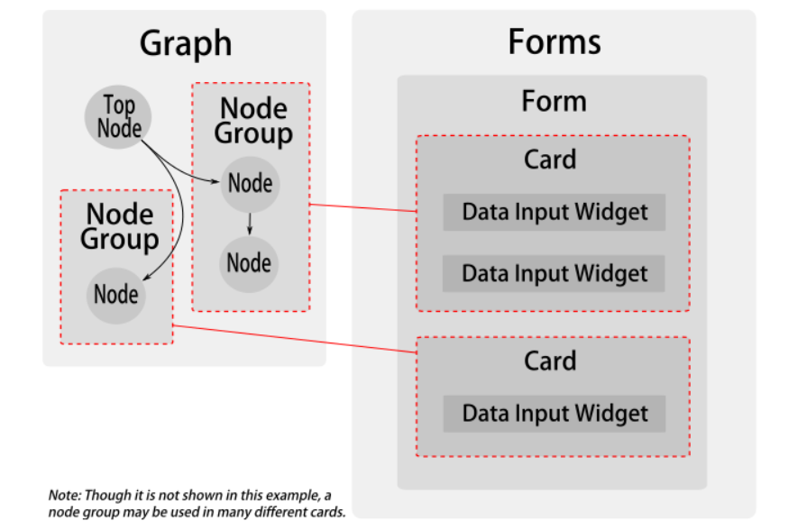

# User Guide

## User Guide Overview

## Resource Manager

Resources in an Arches database are separated into distinct resource "classes," and in v4 the way a user creates and manages these classes has been completely redesigned. Arches now handles all of these operations in the Resource Manager (which you must be logged in to access), and resource classes are made of modular components that can be re-used throughout the system.

The basic components of a resource class are a graph, a series of data entry forms, and a report. In the Arches interface, each of these components comprise various sub-components, as illustrated below.

All of these UI components work together to facilitate data input and display:

1. The graph is made of node groups that define what information will be gathered for a given resource class.
2. The forms are made of cards that are tied to specific node groups and define what input widget will be used to gather a value for each node.

Behind the scenes, these components are defined using many Python classes that are stored as Django models. Instances of these classes are stored in separate database tables, in order to support and enforce relationships. For example, the following the following illustrates a very basic example of the interaction between node groups and cards.

Once values have been entered into the widgets in a card, the business data is saved as a "tile". These tiles are stored as JSON objects in the Postgres database, and are the only format in which resource data exist.

In the example, two very simple node groups are shown. Note that a node group may in fact be very complex, and hold many more than two nodes. As you can see, these node groups are used as the basis for "cards", which are used in the data entry forms. Each card is associated with one or more node groups, and assigns a widget (e.g. a dropdown selection list or calendar date picker) to each node. A card can also record other properties like validation functions.

